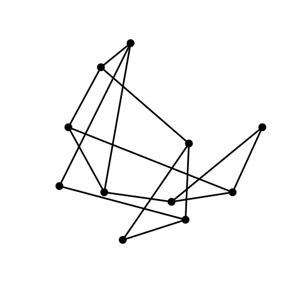

# planwem

[](https://github.com/Glebanister/planwem/actions/workflows/cmake.yml)

Implementation of planar graph layout in the plane by representing its edges as springs. Initially the algorithm generates a random layout and then tries to improve it.

## Setup

First, make sure `git`, `cmake` and `g++` are installed on your machine. Then execute following commands in terminal

```bash
git clone --recursive https://github.com/Glebanister/planwem
cd planwem
mkdir build && cd build
cmake .. && cmake --build
```

## Run

There are no options for executable so far, so you can just type `./build/planwem` in terminal. Result of program execution is a `.svg` file.

## Example

A little animated example of `planwem` work for some small planar graph. Well, it's not perfect, so I have some improvements to do.


